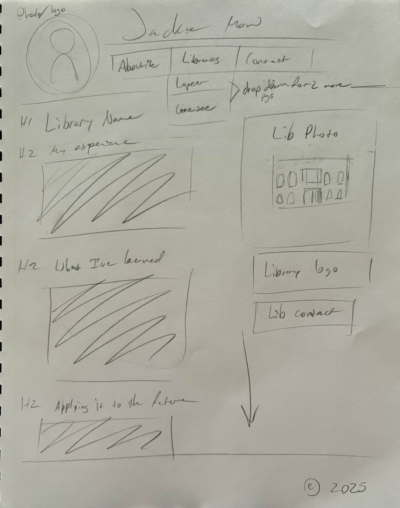

# INF 6420 - Intro to Web Development

Portfolio for my experience in Libraries

## Wireframes

Site plan- About page

Header - name, navigation, photo/logo

Navigation - links to about, libraries, contact

Main Content - start on about/why this project

Footer - copyright and year

 Site Plan- Libraries page 1

 

 Header - name, navigation, photo/logo

 Navigation - Links to about, libraries-has drop down for two libraries, contact

 Main Content - two pages of this, one for Lapeer library and another for Genesee library, has my summaries and comparisons of the libararies, photos

 Footer - copyright and year

Site Plan- Libraries page 2

 

 Header - name, navigation, photo/logo

 Navigation - Links to about, libraries-has drop down for two libraries, contact

 Main Content - two pages of this, one for Lapeer library and another for Genesee library, has my summaries and comparisons of the libararies, photos

 Footer - copyright and year

 Site Plan - Contact

 

  Header - name, navigation, photo/logo

 Navigation - Links to about, libraries-has drop down for two libraries, contact

 Main Content - Contact me, has a way to submit a comment that includes the person's email and name. 

 Footer - copyright and year